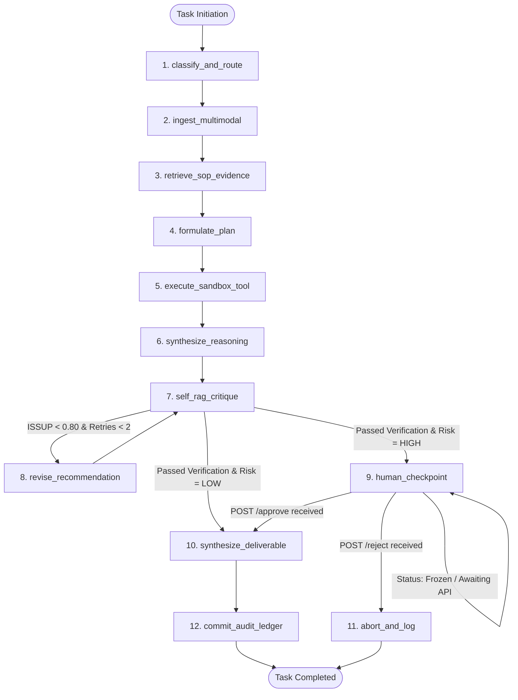

# LangGraph Agent Orchestrator Design
## StateGraph Architecture, Cyclic State Machines & Deterministic Checkpoints

---

## 1. Architectural Role & Execution Model
The LangGraph Orchestrator serves as the central control plane of ABHEDYA AI. Rather than executing a simple linear script, all industrial tasks are executed as a compiled cyclic state machine (`StateGraph`).

This architecture delivers three critical operational capabilities:
1. **Dynamic Cyclic Revision:** Enables the Self-RAG critique gate to cycle back to a revision node if an ungrounded claim is detected.
2. **Deterministic State Persistence:** Persists execution state to PostgreSQL at every step, enabling full recovery from hardware failures.
3. **Human-in-the-Loop Interruption:** Freezes execution state at the `human_checkpoint` node, awaiting an authorized external API call to resume.

---

## 2. The `WorkbenchState` Schema (`backend/app/agent/state.py`)

```python
from typing import List, Dict, Any, Optional
from pydantic import BaseModel, Field

class WorkbenchState(BaseModel):
    # Core Task Identifiers
    task_id: str
    prompt: str
    file_path: Optional[str] = None
    task_type: Optional[str] = None
    priority: str = "normal"
    risk_level: str = "LOW"  # LOW, MEDIUM, HIGH, CRITICAL

    # Model & Routing Information
    selected_models: List[str] = Field(default_factory=list)
    routing_rationale: Optional[str] = None

    # Ingestion & Vision Artifacts
    ocr_text: Optional[str] = None
    table_data: Optional[List[Dict[str, Any]]] = None
    visual_findings: Optional[List[str]] = None

    # Knowledge Retrieval & Context
    retrieved_context: List[Dict[str, Any]] = Field(default_factory=list)
    citations: List[Dict[str, Any]] = Field(default_factory=list)

    # Execution & Tool Outputs
    execution_plan: List[str] = Field(default_factory=list)
    tool_results: Dict[str, Any] = Field(default_factory=dict)
    draft_response: Optional[str] = None

    # Verification & Quality Gate
    verification_passed: bool = False
    isrel_score: float = 0.0
    issup_score: float = 0.0
    critique_notes: Optional[str] = None
    revision_count: int = 0

    # Human Oversight & Approval
    awaiting_approval: bool = False
    operator_decision: Optional[str] = None  # approve, edit, reject
    operator_id: Optional[str] = None
    operator_notes: Optional[str] = None

    # Deliverables & Audit
    deliverable_path: Optional[str] = None
    audit_hash: Optional[str] = None
    error: Optional[str] = None
```

---

## 3. Compiled StateGraph Topology



---

## 4. SSE Event Emission Standard
At every node transition, the orchestrator invokes `emit_step()` in `backend/app/core/emitter.py`:
- Emits real-time event packets consumed by the frontend `useAgentTrace` hook.
- Payload includes `node_name`, `status` (`started`, `running`, `completed`), `tool`, `output`, and millisecond execution timestamp.
