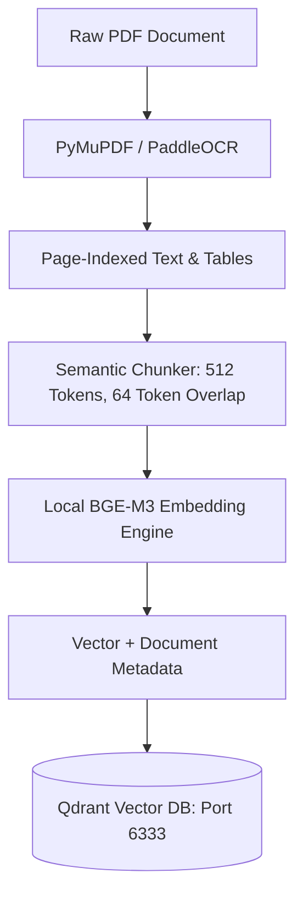

# Knowledge Corpus Management & Ingestion Specification
## Synthetic MRPL SOPs, Chunking Strategies & Vector Store Seeding

---

## 1. Domain Corpus Definition
To ground ABHEDYA AI's reasoning in authentic industrial safety procedures without breaching corporate non-disclosure agreements, the system utilizes a curated corpus of **synthetic industrial engineering documents** modeled after real refinery operational manuals:

```text
data/sample_sops/
├── MRPL_SOP_HC_102_Piping_Inspection.pdf      # Hydrocracker piping inspection guidelines
├── OISD_105_Work_Permit_System.pdf            # Hot work & confined space safety permits
├── API_570_Piping_Inspection_Code_Extract.pdf # Corrosion rate & retirement formulas
├── API_510_Pressure_Vessel_Inspection.pdf    # Vessel shell thickness limits
├── NDT_Ultrasonic_Calibration_Manual.pdf     # Ultrasonic transducer calibration steps
└── MRPL_Corrosion_Control_Manual.pdf          # Amine & H2S corrosion mitigation procedures
```

---

## 2. Ingestion & Chunking Pipeline (`scripts/seed_sops.py`)



### Chunking Specification:
- **Chunk Size:** 512 tokens (~1,800 characters)
- **Overlap:** 64 tokens (~220 characters)
- **Metadata Preserved per Chunk:**
  - `document_name`: e.g., `API_570_Piping_Inspection_Code_Extract.pdf`
  - `standard_code`: e.g., `API 570 Section 7.1.1`
  - `page_number`: e.g., `14`
  - `section_heading`: e.g., `Calculation of Corrosion Rate and Remaining Life`
  - `tags`: e.g., `["#Hydrocracker", "#Piping", "#API570", "#Corrosion"]`

---

## 3. Tagged RAG Knowledge Collections
In accordance with the Open WebUI industrial gap analysis, knowledge is organized into **Tagged Collections**:
- Operators can filter semantic retrieval by prepending tags in the composer:
  - `@collection:hydrocracker Analyze line HC-102-B`
  - `#OISD-105 Verify safety checklist`
- The Qdrant retriever applies strict metadata payload filters before computing cosine similarity, reducing retrieval noise and latency.
