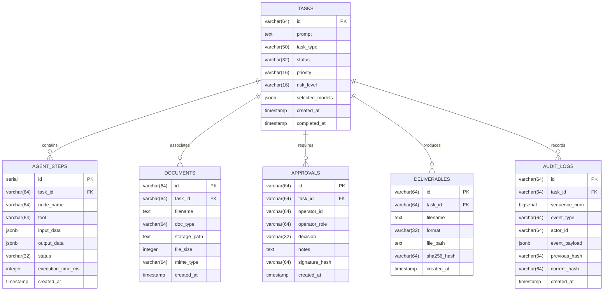

# Database Schema Specification
## PostgreSQL Relational Storage, SQLAlchemy Models & Migration Strategy

---

## 1. Storage Architecture
ABHEDYA AI utilizes a single, isolated PostgreSQL database instance (`postgres:16-alpine`) hosted inside the internal Docker bridge network. The database maintains operational task lifecycles, real-time agent execution traces, document metadata, knowledge chunks, and the cryptographic audit ledger.

---

## 2. Complete Entity-Relationship Model

---

## 3. SQLAlchemy Implementation (`backend/app/db/models.py`)

The codebase models are aligned with the target schema:
- `Task`: Root task object with relationships to steps, documents, and approvals.
- `AgentStep`: Captures node execution for SSE replay and UI timeline rendering.
- `Document`: Tracks both user-uploaded raw files and system-generated outputs.
- `Approval`: Records operator decisions (`approve`, `edit`, `reject`) and digital signatures.
- `Deliverable`: Tracks synthesized `.docx` and `.xlsx` files with SHA-256 hashes.
- `AuditLog`: Enforces the forward-chained SHA-256 audit ledger.
- `NetworkEvent`: Logs network boundary violations or suspicious socket states.

---

## 4. Migration Strategy
Database migrations are managed using **Alembic**:
- Initial baseline migration creates all core tables.
- Automatic table creation fallback exists in `backend/app/db/session.py` for rapid prototyping (`Base.metadata.create_all(bind=engine)`).
- SQLite in-memory fallback is supported exclusively for headless unit testing (`sqlite:///:memory:`).
