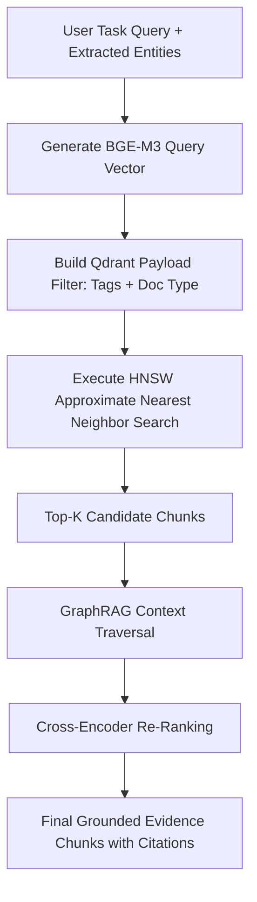

# Hybrid Agentic RAG Architecture
## Qdrant HNSW Vector Search, Metadata Filtering & GraphRAG Relations

---

## 1. Architectural Intent & Objectives
In confidential industrial workflows, general semantic search alone is insufficient. An engineer querying for minimum wall thickness on line `HC-102-B` requires the exact clause from **API 570 Section 7** applied specifically to carbon steel piping operating at $380^\circ\text{C}$.

ABHEDYA AI implements **Hybrid Agentic RAG**, combining:
1. **Dense Vector Retrieval (Qdrant):** Fast semantic similarity search using BGE-M3 local embeddings.
2. **Metadata Payload Filtering:** Scopes retrieval by equipment ID, standard code, and tagged collections (`#Hydrocracker`).
3. **GraphRAG Entity Linking:** Traverses relational links between plant assets, inspection findings, and standard procedures.

---

## 2. Qdrant HNSW Vector Indexing Configuration

The vector store runs locally inside Docker (`qdrant/qdrant:latest`) on port `6333`:
- **Vector Dimension:** 1,024 (BGE-M3 embedding dimension).
- **Distance Metric:** Cosine similarity.
- **Index Configuration:**
  - $M = 16$ (Maximum edges per node in HNSW graph).
  - $ef_{\text{construct}} = 100$ (Graph build quality).
  - On-disk payload storage with in-memory vector quantization for sub-50ms latency.

---

## 3. The Retrieval Pipeline (`backend/app/rag/retriever.py`)

---

## 4. GraphRAG Relational Context Traversal
While dense vectors retrieve similar text snippets, GraphRAG resolves complex plant dependencies:

$$\text{Equipment: Line HC-102-B} \xrightarrow{\text{has defect}} \text{Pitting Corrosion} \xrightarrow{\text{governed by}} \text{API 570 Code} \xrightarrow{\text{mandates}} \text{Ultrasonic Turnaround Inspection}$$

When an equipment tag (e.g., `HC-102-B`) is detected in the query:
1. The retriever queries the relational graph for associated piping specs, operating pressures, and historical NDT logs.
2. The associated context is appended to the vector search query, ensuring the model reasons over the complete engineering reality.

---

## 5. UI Evidence Transparency (`RAGSourceCard`)
The frontend never presents a claim without its supporting evidence:
- Every generated sentence linked to a standard is suffixed with a clickable citation badge `[Source 1]`.
- Clicking the badge opens the `RAGSourceCard` in the Context Panel, displaying:
  - Document title: `API_570_Piping_Inspection_Code_Extract.pdf`
  - Section heading: `Section 7.1.1: Corrosion Rate Calculation`
  - Exact text excerpt highlighted with page number (`Page 14`).
  - Retrieval relevance score: `0.94`.
