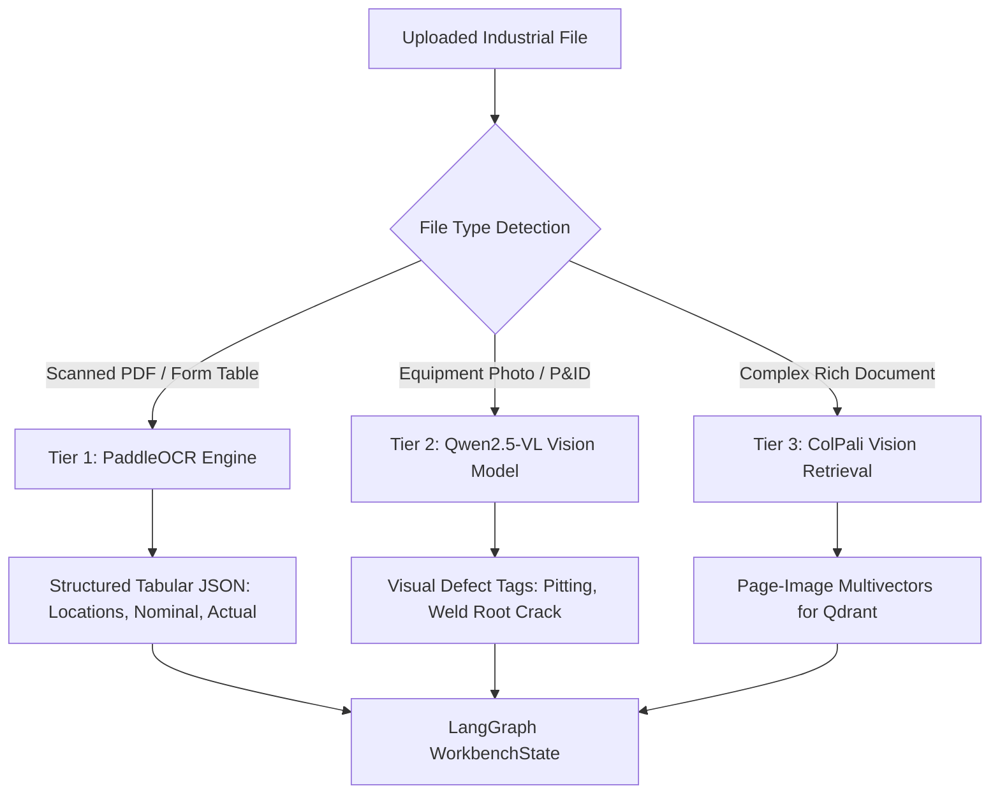

# Multimodal Ingestion Pipeline Specification
## PaddleOCR, Qwen2.5-VL & Vision-Native Document Intelligence

---

## 1. The Multimodal Industrial Challenge
Industrial engineering data cannot be processed by generic plain-text parsers:
- **Scanned Ultrasonic Inspection Sheets:** Contain structured grids of numeric thickness readings, calibration blocks, and hand-written inspector signatures.
- **Piping & Instrumentation Diagrams (P&IDs):** Contain symbolic line numbers, flow arrows, control valves, and pressure indicators.
- **Inspection Photographs:** High-resolution photographs showing pitting corrosion, flange leaks, or weld defects.

Converting these artifacts into flat text using standard OCR destroys spatial geometry, resulting in incorrect calculations and missed safety warnings.

---

## 2. Multi-Tier Multimodal Architecture



---

## 3. Tier 1: PaddleOCR for Tabular Extraction
- **Role:** High-accuracy extraction of text and structured tables from scanned PDF documents.
- **Algorithm:** Uses DBNet for text detection and SVTR for text recognition; reconstructs table HTML/JSON using table-structure recognition models.
- **Output Schema:**
  ```json
  {
    "table_detected": true,
    "headers": ["Point ID", "Nominal (mm)", "Actual (mm)", "Retirement (mm)"],
    "rows": [
      ["P-01", 6.02, 3.20, 2.50],
      ["P-02", 6.02, 3.15, 2.50],
      ["P-03", 6.02, 2.80, 2.50]
    ]
  }
  ```

---

## 4. Tier 2: Qwen2.5-VL for Visual Engineering Inspection
- **Role:** Visual reasoning over equipment photographs and complex schematics.
- **Inference Task:** Generates bounding box coordinates, anomaly descriptions, and surface condition assessments:
  ```json
  {
    "anomaly_detected": true,
    "defect_type": "Localized Pitting Corrosion",
    "severity": "HIGH",
    "bounding_box": [340, 120, 580, 410],
    "description": "Severe localized pitting adjacent to weld HAZ; estimated pit depth exceeds 1.5mm."
  }
  ```

---

## 5. Tier 3: ColPali for Vision-Native Document Retrieval
- **Role:** Direct retrieval of visually complex document pages without loss of visual layout.
- **Mechanism:** Treats entire PDF pages as images; generates multi-vector patch embeddings that enable semantic search directly over diagrams, flowcharts, and complex formulas.
