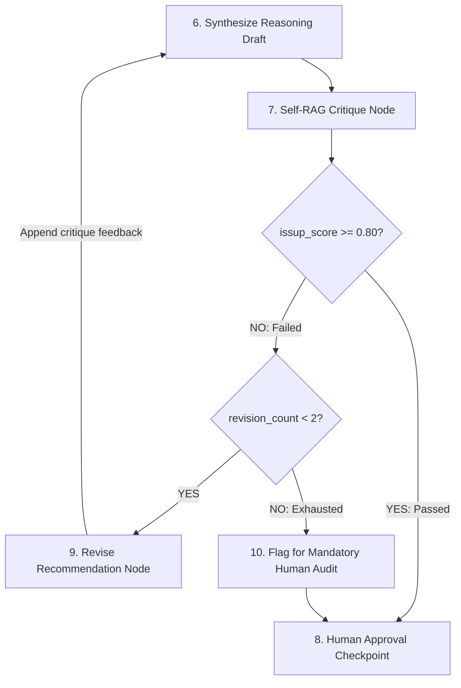

# Self-RAG Verification & Critique Gate Design
## Inline Quality Evaluation, Grounding Tokens & Automated Revision Loops

---

## 1. Architectural Intent & Scope
LLMs can generate plausible-sounding but factually incorrect engineering advice ("hallucination"). In an oil refinery, recommending that a degraded pipe can operate for 5 years when statutory standards mandate immediate replacement can lead to catastrophic line rupture.

ABHEDYA AI implements an inline **Self-RAG Critique Gate** as a mandatory evaluation node in the LangGraph state machine.

> **Important Terminology Boundary:** We utilize an algorithmic verification implementation inspired by Self-RAG research principles. We do not claim that Self-RAG provides a 100% mathematical guarantee of factual perfection; rather, it provides an automated, rigorous quality gate that rejects ungrounded claims before human review.

---

## 2. Critique Dimensions & Scoring Metrics

The Self-RAG critique gate evaluates draft answers across three distinct criteria:

```text
┌─────────────────────────────────────────────────────────────────────────────┐
│                       SELF-RAG CRITIQUE DIMENSIONS                          │
├─────────┬──────────────────────────┬────────────────────────────────────────┤
│ TOKEN   │ EVALUATION METRIC        │ ACCEPTANCE THRESHOLD                   │
├─────────┼──────────────────────────┼────────────────────────────────────────┤
│ `ISREL` │ Retrieval Relevance      │ $\ge 0.70$ (Retrieved context is       │
│         │                          │ relevant to the industrial query)      │
├─────────┼──────────────────────────┼────────────────────────────────────────┤
│ `ISSUP` │ Claim Grounding Support  │ $\ge 0.80$ (Every quantitative claim   │
│         │                          │ is explicitly supported by context)    │
├─────────┼──────────────────────────┼────────────────────────────────────────┤
│ `ISUSE` │ Operational Usefulness   │ $\ge 0.75$ (Answer directly solves     │
│         │                          │ the operator's inspection task)        │
└─────────┴──────────────────────────┴────────────────────────────────────────┘
```

---

## 3. The Self-Critique Prompt Formulation

```text
System: You are an impartial Industrial AI Verification Auditor at MRPL Refinery.
Task: Evaluate the draft engineering recommendation against the provided retrieved Standard Operating Procedures.

[Retrieved SOP Context]:
{retrieved_context}

[Draft Engineering Recommendation]:
{draft_response}

Instructions:
1. Assess whether the retrieved context is relevant to the task (ISREL: 0.0 to 1.0).
2. Check every numerical value, code citation, and safety threshold in the draft. 
   Does the retrieved context explicitly support these claims? (ISSUP: 0.0 to 1.0).
3. If unsupported claims exist, list the exact discrepancies.

Output valid JSON:
{
  "isrel_score": 0.95,
  "issup_score": 0.85,
  "isuse_score": 0.90,
  "verification_passed": true,
  "unsupported_claims": [],
  "critique_summary": "All thickness calculations and API 570 citations match Section 7."
}
```

---

## 4. Cyclic Revision State Machine



- If `issup_score < 0.80`, the critique feedback is injected back into the prompt, and the reasoning model rewrites the draft.
- If the model fails verification after 2 automated revision attempts, the workflow flags the task as `VERIFICATION_FAILED` and forces manual human review in the UI.
