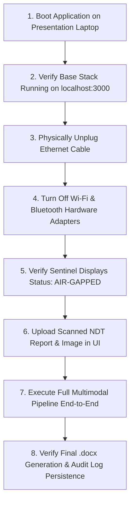

# Zero-Egress Air-Gap Validation Procedures
## Repeatable Test Scripts, Socket Audits & Physical Network Disconnect Demonstration

---

## 1. Objectives & Compliance Standard
To substantiate the claim that ABHEDYA AI is a sovereign, air-gapped system, the development team must execute and document two formal verification procedures:
1. **Automated Continuous Socket Audit:** Verification that no external network sockets are opened during intensive processing.
2. **Physical Disconnection Demonstration:** Proving the application functions flawlessly when all physical network interfaces are disabled.

---

## 2. Test Procedure 1: Automated Continuous Socket Audit

### Execution Steps
1. Boot the full application stack via `docker compose up -d`.
2. Start continuous packet capture in the background:
   ```bash
   sudo tcpdump -i any -n not net 127.0.0.0/8 and not net 172.16.0.0/12 -w /tmp/egress_audit.pcap &
   TCPDUMP_PID=$!
   ```
3. Submit 5 heavy multimodal inspection tasks through the frontend or via automated curl script:
   ```bash
   python scripts/simulate_heavy_workload.py
   ```
4. Stop packet capture and analyze results:
   ```bash
   kill -SIGINT $TCPDUMP_PID
   tcpdump -r /tmp/egress_audit.pcap
   ```

### Success Criterion
The resulting PCAP file must contain **0 packets**. Any captured packet destined for an external IP constitutes an immediate test failure.

---

## 3. Test Procedure 2: Physical Network Disconnect Demonstration

This test represents the definitive proof presented during the SIH evaluation:



### Demonstration Script for Judges:
1. *Action:* "Judges, watch as I disable all Wi-Fi and pull the Ethernet cable. Our laptop is completely air-gapped."
2. *Proof:* Run `ping 8.8.8.8` in terminal $\rightarrow$ `Network is unreachable`.
3. *Execution:* Upload `HC_102_B_UT_Inspection_Report.pdf` $\rightarrow$ watch timeline stream OCR, vector search, math calculation, and Self-RAG critique.
4. *Delivery:* Download generated Word document; point to the Sentinel showing `Outbound Bytes: 0`.
