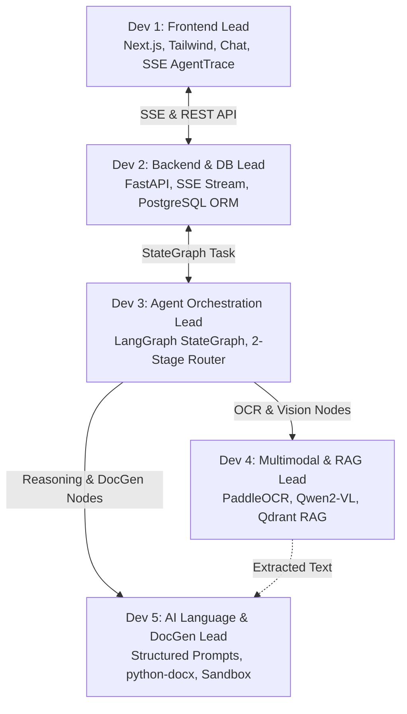

# 5-Member Developer Implementation Plan (Excluding Deployment)

**Project:** Sovereign On-Premise Agentic AI Workbench  
**Problem Statement:** PS ID 26117 · Smart Automation · Mangalore Refinery and Petrochemicals Limited (MRPL)  
**Scope:** Core software engineering, AI/ML pipelines, agent orchestration, and frontend application (36–48 Hour Hackathon Window)

---

## 1. 5-Member Team Division of Ownership

```text
┌─────────────────────────────────────────────────────────────────────────────┐
│                           5-MEMBER TEAM TOPOLOGY                            │
└─────────────────────────────────────────────────────────────────────────────┘

  ┌─────────────────────────┐
  │   Dev 1: Frontend Lead  │
  │ • Next.js 14 + Tailwind │
  │ • Chat & File Upload UI │
  │ • SSE AgentTrace Panel  │
  │ • Sentinel Widget       │
  └────────────┬────────────┘
               │
               │ HTTP REST & SSE Stream
               ▼
  ┌─────────────────────────┐
  │  Dev 2: Backend & DB    │
  │ • FastAPI Gateway       │
  │ • SSE Stream Producer   │
  │ • PostgreSQL & ORM      │
  │ • File Upload Storage   │
  └────────────┬────────────┘
               │
               │ Graph Invocations (WorkbenchState)
               ▼
  ┌─────────────────────────┐
  │ Dev 3: Agent Orchestrate│
  │ • LangGraph StateGraph  │
  │ • 2-Stage Dynamic Router│
  │ • Human Checkpoint Node │
  │ • Step Event Emitter    │
  └───────┬───────────┬─────┘
          │           │
          │ Node      │ Node
          │ Execution │ Execution
          ▼           ▼
  ┌────────────────┐ ┌──────────────────────┐
  │ Dev 4: Vision  │ │ Dev 5: Language & Doc│
  │ • PaddleOCR    │ │ • Structured JSON    │
  │ • Qwen2-VL     │ │ • python-docx Note   │
  │ • Qdrant RAG   │ │ • Code Sandbox       │
  │ • bge-small-en │ │ • openpyxl Reader    │
  └───────┬────────┘ └──────────▲───────────┘
          │                     │
          └──── Context Text ───┘
```

<details>
<summary><b>Click to view Mermaid Diagram</b></summary>



</details>

| Member | Focus Area | Primary Tech Stack | Core Deliverables |
| :--- | :--- | :--- | :--- |
| **Dev 1: Frontend Lead** | User Interface & Real-time State | Next.js 14, React, Tailwind CSS, Zustand | `ChatWindow.tsx`, `AgentTrace.tsx`, `NetworkSentinel.tsx`, `ApprovalCheckpoint.tsx`, `FileUpload.tsx` |
| **Dev 2: Backend & DB Lead** | API Gateway, Streaming & Storage | Python, FastAPI, PostgreSQL, SQLAlchemy, SSE | `main.py`, `api/chat.py`, `api/upload.py`, `api/tasks.py`, `api/network.py`, `db/models.py`, `db/session.py` |
| **Dev 3: Agent Orchestration Lead** | LangGraph, Routing & Graph State | Python, LangGraph, Pydantic | `agent/state.py`, `agent/graph.py`, `agent/router.py`, `agent/nodes/classify.py`, `agent/nodes/human_checkpoint.py` |
| **Dev 4: Multimodal & RAG Lead** | Document OCR, Vision & Vector RAG | PaddleOCR, Qwen2-VL, Qdrant, `bge-small-en` | `tools/ocr_tool.py`, `models/embeddings.py`, `rag/indexer.py`, `rag/retriever.py`, `agent/nodes/ocr.py`, `agent/nodes/vision.py` |
| **Dev 5: AI Language, Tools & DocGen Lead** | Prompt Engineering, Sandbox & Word Output | Ollama (`Qwen2.5-7B`, `Coder-7B`), `python-docx`, `openpyxl` | `agent/nodes/extract_findings.py`, `agent/nodes/recommend.py`, `tools/docx_writer.py`, `tools/sandbox.py`, `tools/xlsx_reader.py` |

---

## 2. Detailed Task Breakdown & Ticket Backlog by Developer

###  Dev 1: Frontend Lead
- [ ] **UI Scaffolding:** Set up Next.js 14 (App Router) with Tailwind CSS and dark-mode industrial palette.
- [ ] **Global Store:** Create Zustand store (`useTaskStore.ts`) to manage active tasks, file attachments, approval states, and streaming logs.
- [ ] **`ChatWindow.tsx`:** Build message feed, Markdown renderer for LLM responses, and prompt input box.
- [ ] **`FileUpload.tsx`:** Implement drag-and-drop file upload supporting PDF, PNG, JPG, and XLSX with upload progress.
- [ ] **`AgentTrace.tsx`:** Build the live step-by-step agent execution panel subscribed to SSE (`/api/tasks/{id}/stream`), showing step icons (spinner, checkmark, error).
- [ ] **`ApprovalCheckpoint.tsx`:** Render the human-in-the-loop modal when status is `awaiting_approval` with **Approve**, **Edit Recommendation**, and **Reject** controls.
- [ ] **`NetworkSentinel.tsx`:** Build top-bar widget polling `/api/network/status` showing `External Connections: 0` and air-gap badges.
- [ ] **Deliverable Download UX:** Enable a direct download button for generated `.docx` / `.xlsx` files when task completes.

---

###  Dev 2: Backend & Database Lead
- [ ] **FastAPI Boilerplate:** Initialize FastAPI app, CORS middleware (localhost), and health check endpoints.
- [ ] **Database Schema & ORM:** Implement SQLAlchemy models for `tasks`, `agent_steps`, `documents`, `knowledge_chunks`, and `network_events`.
- [ ] **`POST /api/upload`:** Implement multipart file endpoint, generate UUIDs, and persist uploaded files to `/app/uploads`.
- [ ] **`POST /api/chat`:** Ingest prompt and `document_id`, create a `tasks` record in DB, and launch LangGraph background execution (`asyncio.create_task`).
- [ ] **`GET /api/tasks/{id}/stream`:** Build Server-Sent Events (SSE) streaming endpoint using `asyncio.Queue` or DB polling for real-time node outputs.
- [ ] **`POST /api/tasks/{id}/approve`:** Implement approval webhook that unblocks the waiting human checkpoint in the active agent task.
- [ ] **`GET /api/tasks/{id}/download`:** File streaming response for generated `.docx` / `.xlsx` files.
- [ ] **`GET /api/network/status`:** Endpoint querying socket states / `/proc/net/tcp` to return live air-gap metrics.

---

###  Dev 3: Agent Orchestration & Routing Lead
- [ ] **State Model:** Define Pydantic `WorkbenchState` containing all shared fields (`task_id`, `prompt`, `ocr_text`, `findings_json`, `sop_hits`, `recommendation`, `approved`, `docx_path`, `error`).
- [ ] **Two-Stage Task Router (`agent/router.py`):**
  - *Stage 1:* Regex/MIME deterministic rule filter (`.xlsx` → coding, images/scans → multimodal, text queries → doc/qa).
  - *Stage 2:* Fast fallback to `Qwen2.5-7B` with strict JSON schema for ambiguous requests.
- [ ] **LangGraph StateGraph Wiring (`agent/graph.py`):** Construct execution nodes and conditional edges for both Flagship Multimodal flow and Coding Agent flow.
- [ ] **Step Event Emitter:** Create centralized `emit_step(task_id, node_name, output)` helper invoked at the end of every node to push to both PostgreSQL and SSE stream.
- [ ] **`human_checkpoint` Node:** Implement asynchronous pause in LangGraph graph that blocks until Dev 2's `/approve` endpoint resolves.
- [ ] **Output Validation Node (`validate_output`):** Assert generated `.docx` contains mandatory headings and valid sections before marking status as `done`.
- [ ] **Auto-Fix Loop:** Implement conditional routing to retry code execution or prompt re-formatting up to 2 times on validation error.

---

###  Dev 4: AI/ML Multimodal & RAG Lead
- [ ] **PaddleOCR Pipeline (`tools/ocr_tool.py`):** Wrap PaddleOCR to extract text blocks, line coordinates, and reconstruct scanned tables into structured text.
- [ ] **VLM Integration (`agent/nodes/vision.py`):** Connect to local Ollama `qwen2-vl:7b` to analyze engineering diagrams, flowcharts, and handwritten inspection notes.
- [ ] **Local Embeddings Setup:** Configure `bge-small-en` embeddings via Ollama / HuggingFace offline local weights.
- [ ] **RAG Indexer (`rag/indexer.py`):** Chunk synthetic refinery SOPs (markdown/txt), compute dense vector embeddings, and upsert points into Qdrant (`mrpl_sops` collection).
- [ ] **RAG Retriever (`rag/retriever.py`):** Implement top-k semantic search with cosine distance thresholding, returning text chunks and formatted document citations (e.g., `[SOP-042, Section 3.1]`).
- [ ] **Synthetic SOP Dataset:** Author 5–10 realistic refinery SOP documents covering boiler maintenance, pressure vessel safety, flange inspection, and corrosion limits.

---

###  Dev 5: AI Language, Tools & DocGen Lead
- [ ] **Ollama Client Wrapper:** Python client with retry logic and JSON schema validation for `Qwen2.5-7B-Instruct`.
- [ ] **`extract_findings` Prompt Node:** Construct zero-shot extraction prompt returning strict JSON `{ equipment, findings, severity, dates, measurements }`.
- [ ] **`compare_and_recommend` Prompt Node:** Construct engineering synthesis prompt matching extracted findings against retrieved SOP excerpts, ending in `APPROVAL RECOMMENDED` or `FURTHER REVIEW REQUIRED`.
- [ ] **Word Approval Note Generator (`tools/docx_writer.py`):** Use `python-docx` to fill an industrial Approval Note template with header metadata, findings table, SOP citations, and approval signatures.
- [ ] **Excel Data Processing Tool (`tools/xlsx_reader.py`):** Use `openpyxl` to parse numerical engineering sheets.
- [ ] **Sandboxed Code Executor (`tools/sandbox.py`):** Execute LLM-generated Python calculation scripts in an isolated subprocess with 10-second timeout, memory bounds, and standard output capture.

---

## 3. Hour-by-Hour Execution Schedule (36–48 Hours)

```text
Phase 1: Foundations (Hours 0–8)
┌──────────────────────┬──────────────────────┬──────────────────────┬──────────────────────┬──────────────────────┐
│ Dev 1: Frontend      │ Dev 2: Backend & DB  │ Dev 3: LangGraph     │ Dev 4: Multimodal/RAG│ Dev 5: AI & DocGen   │
│ UI scaffolding,      │ FastAPI skeleton,    │ State schema,        │ PaddleOCR test,      │ Ollama client,       │
│ layout, theme        │ PostgreSQL schema    │ router logic         │ Qdrant indexer setup │ JSON prompt testing  │
└──────────────────────┴──────────────────────┴──────────────────────┴──────────────────────┴──────────────────────┘

Phase 2: Core Components (Hours 8–20)
┌──────────────────────┬──────────────────────┬──────────────────────┬──────────────────────┬──────────────────────┐
│ Dev 1: Frontend      │ Dev 2: Backend & DB  │ Dev 3: LangGraph     │ Dev 4: Multimodal/RAG│ Dev 5: AI & DocGen   │
│ ChatWindow, Upload,  │ /upload, /chat,      │ Graph wiring,        │ Qwen2-VL integration,│ extract_findings,    │
│ Sentinel widget      │ SSE stream builder   │ emit_step helper     │ SOP embedding & RAG  │ python-docx template │
└──────────────────────┴──────────────────────┴──────────────────────┴──────────────────────┴──────────────────────┘

Phase 3: Integration & Agentic Loop (Hours 20–32)
┌──────────────────────┬──────────────────────┬──────────────────────┬──────────────────────┬──────────────────────┐
│ Dev 1: Frontend      │ Dev 2: Backend & DB  │ Dev 3: LangGraph     │ Dev 4: Multimodal/RAG│ Dev 5: AI & DocGen   │
│ AgentTrace SSE wire, │ /approve, /download, │ human_checkpoint,    │ Retriever node,      │ compare_recommend,   │
│ Approval Modal       │ Sentinel status API  │ auto-retry loop      │ scan pre-processing  │ sandbox runner tool  │
└──────────────────────┴──────────────────────┴──────────────────────┴──────────────────────┴──────────────────────┘

Phase 4: End-to-End Hardening & Rehearsal (Hours 32–44)
┌──────────────────────────────────────────────────────────────────────────────────────────────────────────────┐
│ ALL DEVELOPERS: End-to-End Flagship Run (Scanned Report ➔ OCR ➔ RAG ➔ Human Checkpoint ➔ Word Note)          │
│ Second Flow Validation: Excel calculation ➔ Sandboxed Python execution                                       │
│ Air-Gap Verification: Physical Ethernet / Wi-Fi pull test with zero failures                                 │
│ Record backup demonstration video                                                                            │
└──────────────────────────────────────────────────────────────────────────────────────────────────────────────┘
```

---

## 4. Internal Component Contracts & Handoffs

```text
1. Dev 1 ➔ Dev 2:
   POST /api/upload ➔ Returns { document_id, filename }
   POST /api/chat   ➔ Payload { prompt, document_id } ➔ Returns { task_id }

2. Dev 2 ➔ Dev 3:
   FastAPI handler calls: await graph.ainvoke(WorkbenchState(task_id=..., prompt=..., file_path=...))

3. Dev 3 ➔ Dev 4:
   Node 'ocr_extract' calls: ocr_tool.extract(state.file_path) ➔ Returns { text, tables }
   Node 'rag_search_sop' calls: retriever.search(state.findings_json) ➔ Returns list[sop_chunks]

4. Dev 3 ➔ Dev 5:
   Node 'extract_findings' calls: prompt_extractor(state.ocr_text) ➔ Returns findings_json
   Node 'compare_and_recommend' calls: prompt_recommender(findings_json, sop_hits) ➔ Returns recommendation
   Node 'generate_docx' calls: docx_writer.build_approval_note(state) ➔ Returns docx_path

5. Dev 3 ➔ Dev 2 ➔ Dev 1:
   emit_step() pushes SSE event ➔ Backend streams to EventSource ➔ Frontend renders live row in AgentTrace
```

---

## 5. Development-Only Testing & Validation Plan

Each developer is responsible for verifying their individual module before cross-member integration:

1. **Dev 1:** Verify `AgentTrace` renders mockup SSE stream without crashing and handles reconnects cleanly.
2. **Dev 2:** Verify Swagger API docs at `http://localhost:8000/docs`, test multipart upload, and test SSE streaming with `curl -N http://localhost:8000/api/tasks/{id}/stream`.
3. **Dev 3:** Run `pytest tests/test_agent_graph.py` to confirm state transitions from start to finish with mock tools.
4. **Dev 4:** Run standalone script `python scripts/test_ocr_rag.py` to assert OCR extracts table text and RAG returns high-confidence SOP hits for boiler corrosion queries.
5. **Dev 5:** Run `python backend/app/tools/docx_writer.py` to verify generated `.docx` opens in Word with valid tables and citations.
