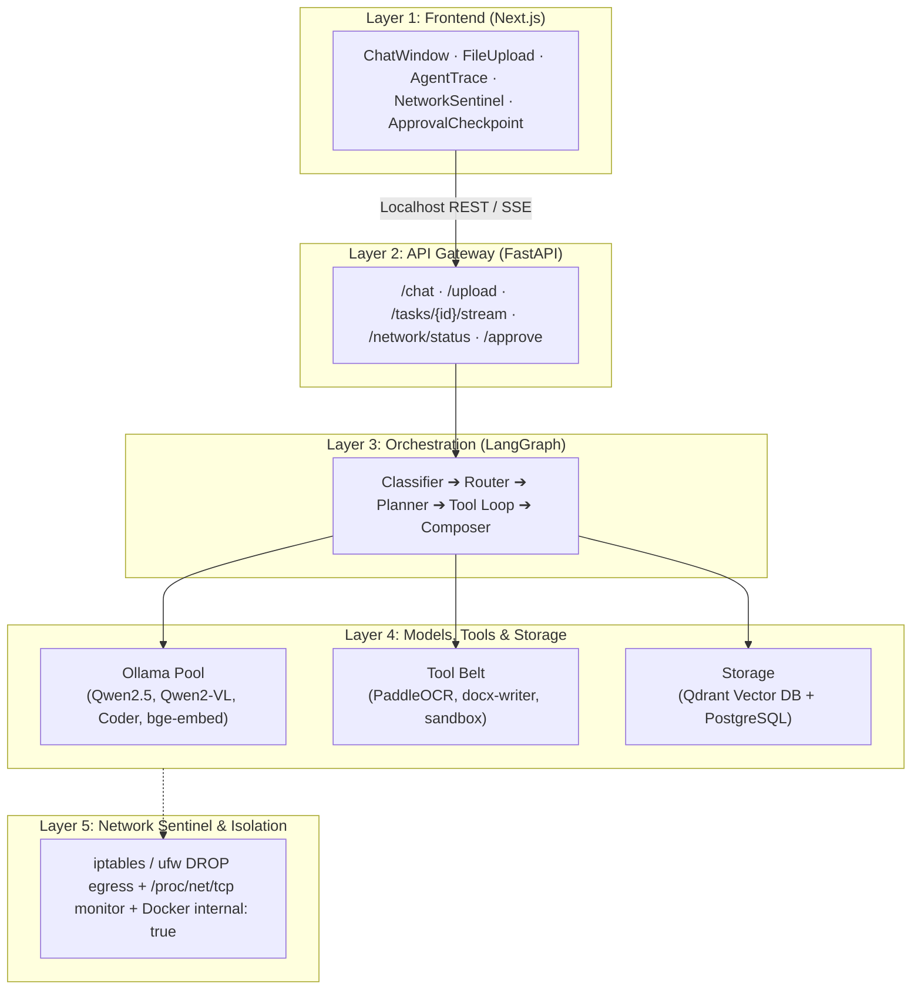
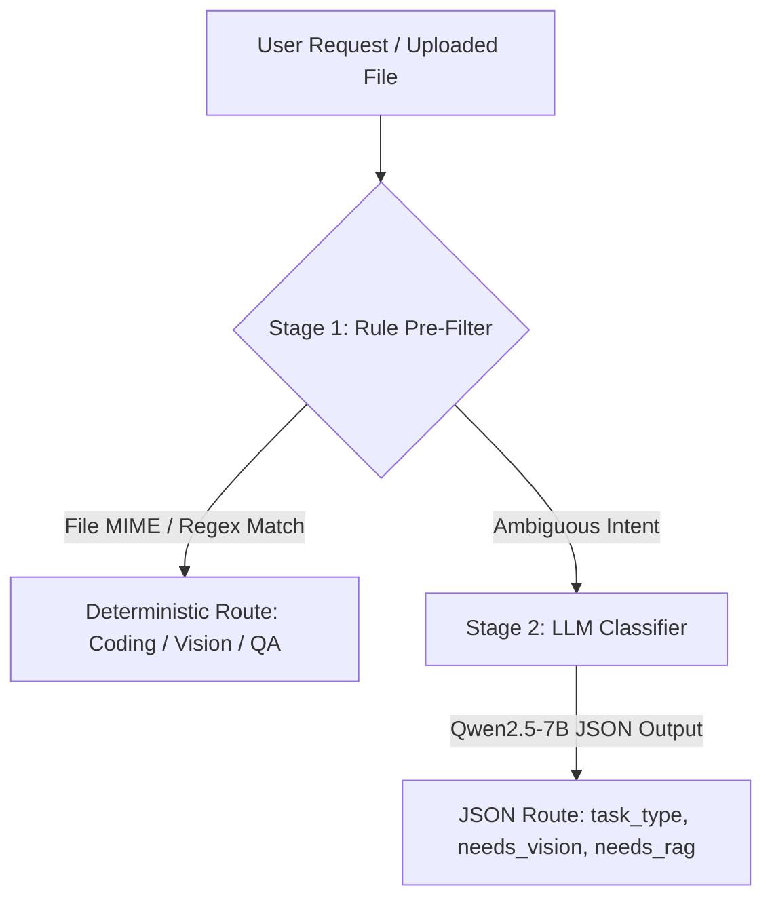
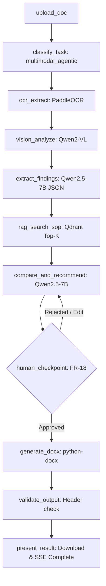

# System Architecture

The Sovereign AI Workbench architecture is built across 5 decoupled layers, designed for modularity, strict local isolation, and verifiable sovereignty.

---

## 1. High-Level 5-Layer Architecture



```text
┌────────────────────────────────────────────────────────────┐
│  1. UI  (Next.js + React + Tailwind + Zustand)            │
│     Chat + file upload + live agent-trace + Network Sentinel│
└───────────────────────────┬────────────────────────────────┘
                            │  localhost only (SSE / REST)
┌───────────────────────────▼────────────────────────────────┐
│  2. API Gateway  (FastAPI)                                 │
│     /chat  /upload  /tasks/{id}/stream  /network/status    │
└───────────────────────────┬────────────────────────────────┘
                            │
┌───────────────────────────▼────────────────────────────────┐
│  3. Orchestration (LangGraph StateGraph)                   │
│   Classifier ─▶ Router ─▶ Planner ─▶ Tool-loop ─▶ Composer │
└───────┬───────────────┬───────────────┬────────────────────┘
        │               │               │
┌───────▼──────┐ ┌──────▼───────┐ ┌─────▼────────┐
│ 4a. Model pool││ 4b. Tool belt ││ 4c. RAG store │
│ Ollama-served ││ OCR / Sandbox ││ Qdrant +      │
│ Qwen2.5, Qwen ││ python-docx / ││ local embed   │
│ 2-VL, embed   ││ openpyxl      ││ model         │
└───────────────┘└───────────────┘└───────────────┘
                            │
┌───────────────────────────▼────────────────────────────────┐
│  5. Sentinel  (network namespace + firewall, not just UI)  │
│     iptables/ufw DROP-all-egress + syscall/conn logger     │
└────────────────────────────────────────────────────────────┘
        EVERYTHING ABOVE RUNS IN ONE DOCKER COMPOSE STACK,
                NO CONTAINER HAS INTERNET EGRESS
```

---

## 2. Component Breakdown

### Layer 1: Frontend User Interface
- **Framework:** Next.js (App Router), React, Tailwind CSS
- **State Management:** Zustand (`useTaskStore.ts`)
- **Key Views:**
  - `ChatWindow.tsx`: Interactive prompt input & message log.
  - `FileUpload.tsx`: Drag-and-drop document intake.
  - `AgentTrace.tsx`: Real-time Server-Sent Events (SSE) consumer rendering step-by-step agent progress.
  - `NetworkSentinel.tsx`: Prominent widget displaying live egress connection counters.
  - `ApprovalCheckpoint.tsx`: Human-in-the-loop approval modal.

### Layer 2: API Gateway
- **Framework:** FastAPI with Uvicorn
- **Responsibilities:**
  - Request routing, payload validation, and multipart file ingestion.
  - Background task invocation for LangGraph workflows (`graph.ainvoke`).
  - Real-time event streaming (`/api/tasks/{id}/stream`) via SSE.
  - Network state polling endpoint (`/api/network/status`).

### Layer 3: Orchestration Engine (LangGraph)
- Uses an explicit `WorkbenchState` schema to track execution steps:
  - `classify_task`
  - `ocr_extract`
  - `vision_analyze`
  - `extract_findings`
  - `rag_search_sop`
  - `compare_and_recommend`
  - `human_checkpoint`
  - `generate_docx`
  - `validate_output`

### Layer 4: Model Pool, Tools & Storage
- **Ollama:** Hosts local models (`Qwen2.5-7B`, `Qwen2-VL-7B`, `Qwen2.5-Coder-7B`, `bge-small-en`).
- **Tool Belt:** PaddleOCR for scan layout & tables, `python-docx` for Approval Note templating, `openpyxl` for Excel ingestion, Docker/subprocess sandbox for safe code execution.
- **Storage:** PostgreSQL for relational state & audit logs; Qdrant for dense vector search over plant SOPs.

### Layer 5: Network Sentinel & Isolation
- Docker container network configured with `internal: true`.
- Host-level firewall rule (`iptables -A OUTPUT -m owner ... -j DROP`).
- Real-time connection inspection daemon querying `/proc/net/tcp` or `psutil`.

---

## 3. Two-Stage Dynamic Model Router



### Route Selection Matrix
| User Intent | Detected `task_type` | Model(s) Engaged | Tools Engaged |
| :--- | :--- | :--- | :--- |
| *“Summarize this SOP”* | `doc_reasoning` | Qwen2.5-7B | RAG search |
| *“Analyze this scanned inspection report and draft an approval note”* | `multimodal_agentic` | Qwen2-VL + Qwen2.5-7B | OCR, RAG, docx-writer |
| *“Write Python to compute pressure drop from this Excel”* | `coding_agentic` | Qwen2.5-Coder-7B | xlsx-reader, sandbox |
| *“What does clause 4.2 of the safety SOP say?”* | `rag_qa` | Qwen2.5-7B + `bge-embed` | RAG search only |

---

## 4. Flagship Agentic Workflow


